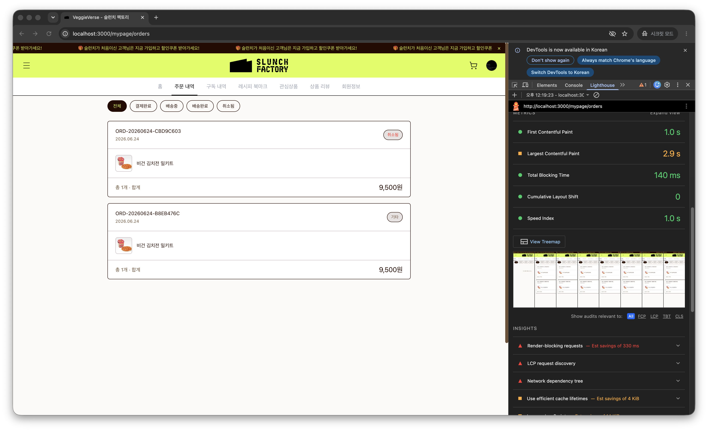
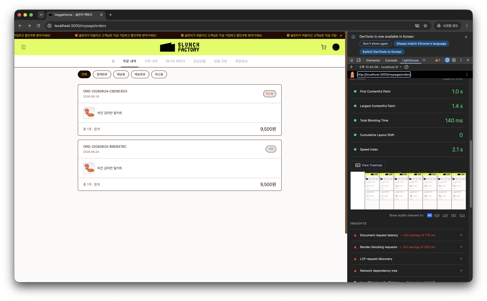
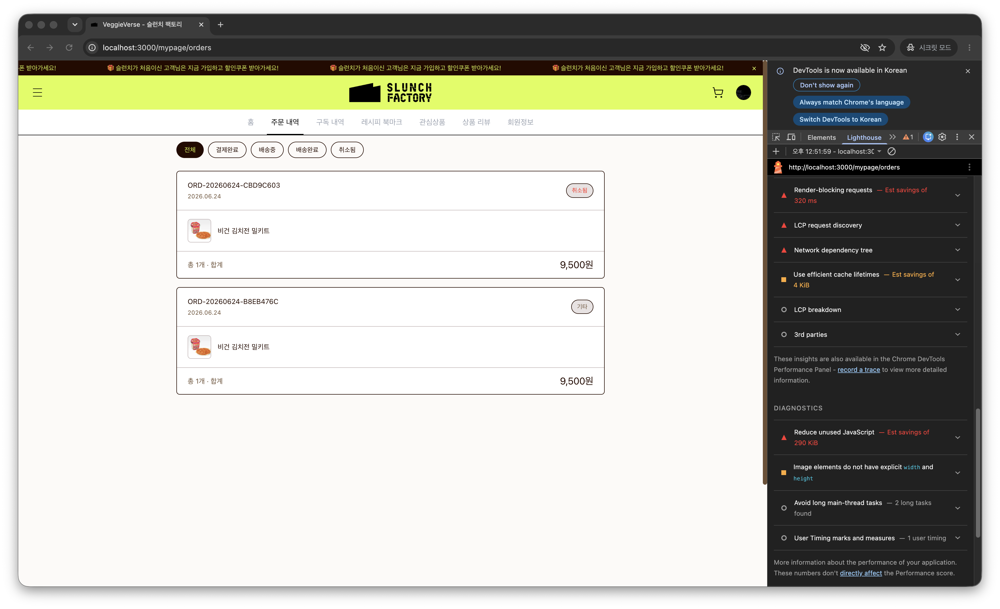
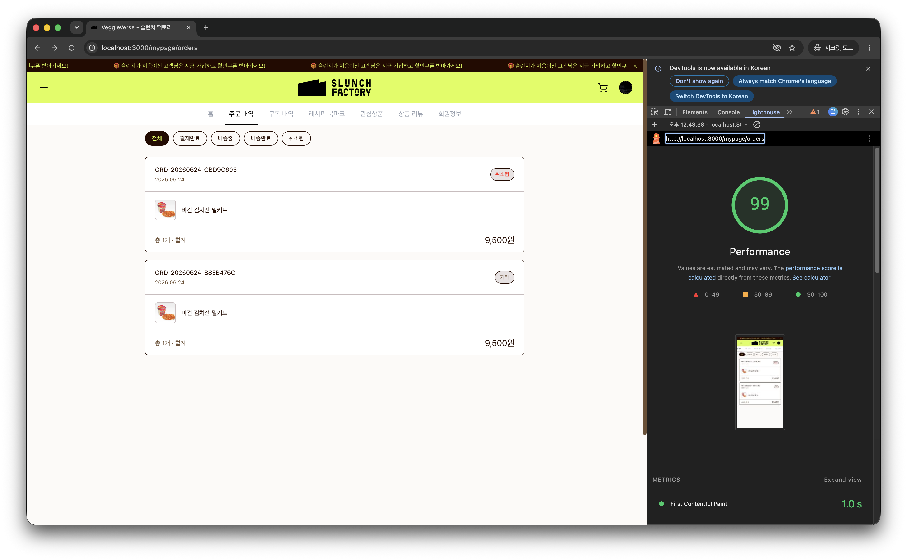
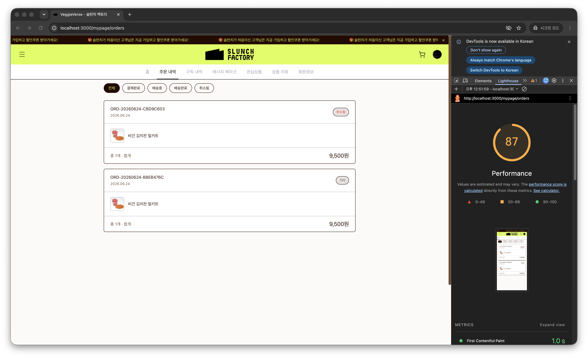
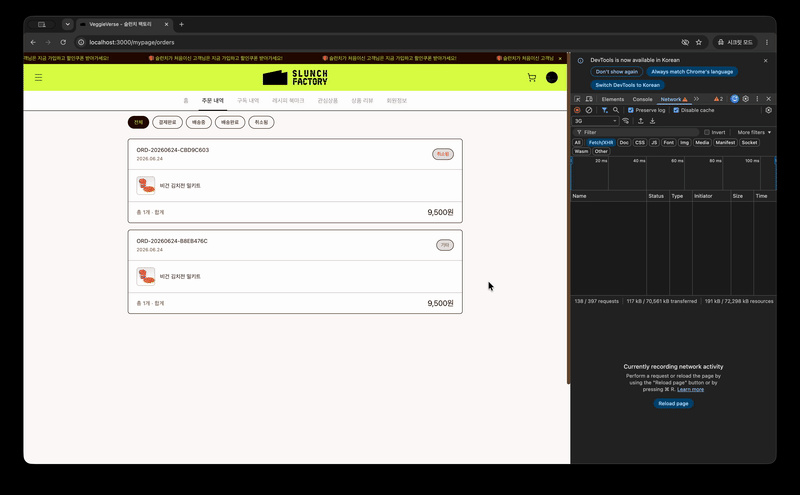
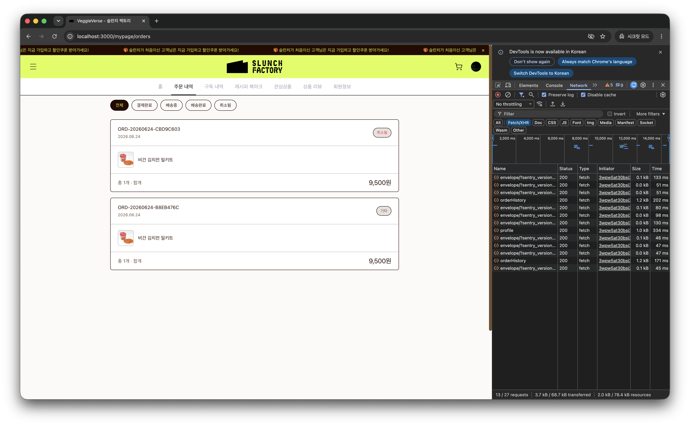
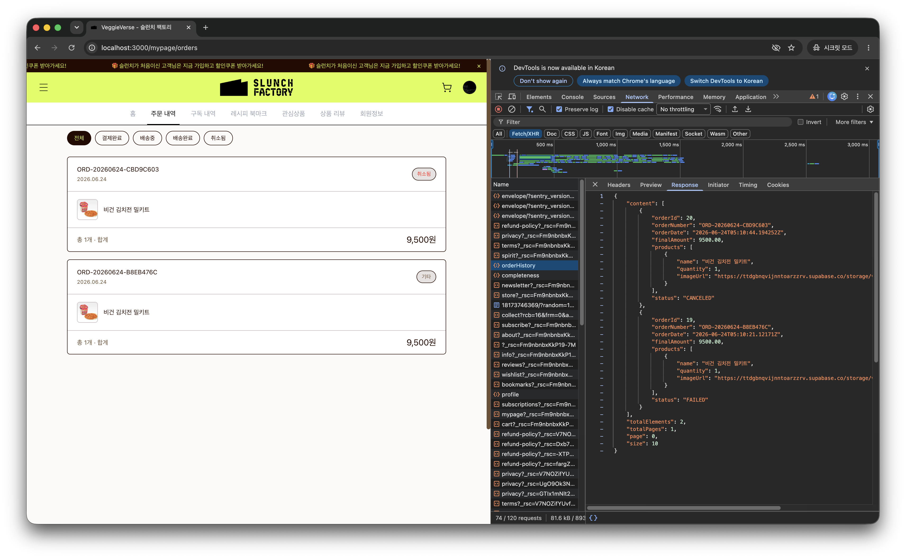
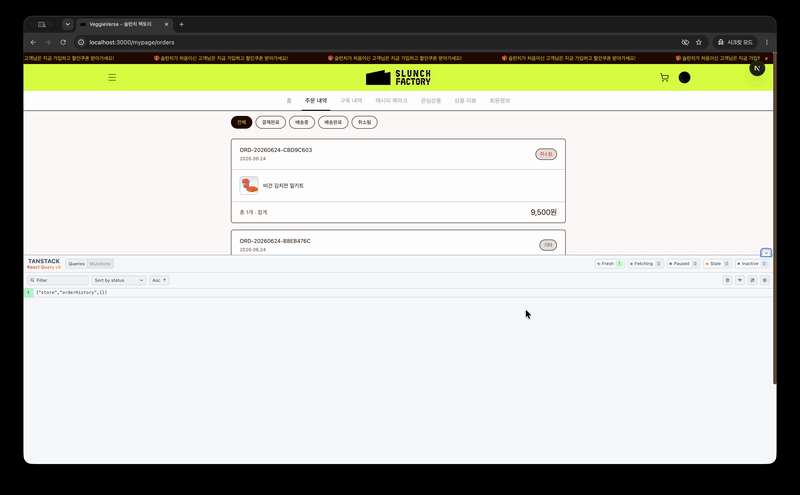

# 빈 화면을 없애려다 배운 것들 — 스켈레톤, shimmer, 그리고 React Query

> "스켈레톤 컴포넌트 하나 만들면 되겠지"로 시작했다가, 측정하는 법부터 다시 배우고, 내가 넣은 코드가 성능을 깎아먹는 걸 발견하고, "React Query를 다 적용하면 안 된다"는 결론까지 가게 된 이야기.

---

## 발단: 흰 화면

느린 네트워크에서 우리 서비스(Next.js 16 App Router, React 19)에 들어가면 한참 동안 **흰 화면**만 떴다. 주문 내역 화면은 그나마 나았는데, 그래봐야 `"주문 내역을 불러오는 중..."` 텍스트 한 줄이 전부였다.

"스켈레톤 깔면 되겠네." 처음엔 그렇게 간단한 일인 줄 알았다. 컴포넌트 하나 만들어서 로딩 중에 보여주면 끝 아닌가. 그런데 막상 시작하니, 끝나는 데까지 한참이 걸렸다.

---

## 1. "개선했다"고 말하려면 먼저 재야 했다

before/after를 비교하려고 `pnpm dev`로 Lighthouse를 돌렸더니 점수가 처참했다. 잠깐 — dev 모드는 번들도 이미지도 최적화가 꺼져 있다. 이 숫자로는 아무 말도 못 한다.

그래서 **prod 빌드(`pnpm build && pnpm start`)**로, 시크릿 창 + Slow 3G + Disable cache를 고정하고 다시 쟀다. 파일럿 화면은 `/mypage/orders`로 골랐다 — 텍스트 한 줄짜리라 before/after 대비가 가장 선명할 것 같았다.

before:



그런데 숫자를 보다가 멈칫했다. **CLS가 이미 0이었다.**

스켈레톤을 넣는 흔한 이유 중 하나가 "레이아웃 점프(CLS) 방지"인데, 이 화면은 점프가 없었다. 그럼 스켈레톤이 여기서 고치는 건 뭐지? Slow 3G 녹화를 보니 답이 나왔다.


LCP 2.9초 동안 사용자는 흰 화면을 본다. 스켈레톤이 바꿀 건 **이 빈 시간의 체감**이지, CLS 수치가 아니었다. 첫 번째 교훈 — **이 작업의 성과는 숫자가 아니라 화면으로 증명해야 한다.** (이 메모를 해둔 게 나중에 결정적으로 작용한다.)

---

## 2. 스켈레톤을 넣었더니, 성능이 나빠졌다

주문 카드와 똑같은 레이아웃의 shimmer 스켈레톤을 만들어 넣고, 같은 조건으로 after를 쟀다. LCP는 2.9s → 1.4s로 좋아졌다. 흐뭇하게 진단 탭을 내리다가 처음 보는 경고를 만났다.

> `Avoid non-composited animations — 23 animated elements found`

그리고 **Speed Index가 1.0s → 2.1s로 거꾸로** 가 있었다.



이상했다. 화면을 더 빨리 보여주려고 넣은 스켈레톤이, 화면이 안정되는 시간을 **늦추고** 있었다. 범인은 내가 방금 넣은 shimmer였다.

코드를 봤다.

```css
/* ❌ background-position 애니메이션 */
@keyframes mp-shimmer {
  0% {
    background-position: -200% 0;
  }
  100% {
    background-position: 200% 0;
  }
}
.mp-skeleton {
  background-image: linear-gradient(
    90deg,
    var(--bg-off) 0%,
    var(--bg-pale) 50%,
    var(--bg-off) 100%
  );
  background-size: 200% 100%;
  animation: mp-shimmer 1.4s ease-in-out infinite;
}
```

`background-position`은 **GPU 합성 대상이 아니다.** 매 프레임 메인스레드에서 다시 칠해진다. 스켈레톤 박스 23개가 동시에 그러니, 브라우저가 화면을 그리느라 바빠서 Speed Index가 늦어진 것이다. 진단의 "23 elements"가 정확히 내 스켈레톤 개수였다.

---

## 3. transform으로 바꿨더니, 경고가 사라졌다

해법은 GPU가 합성해주는 속성으로 바꾸는 것 — `transform`과 `opacity`. shimmer를 움직이는 하이라이트(`::after`)의 `translateX`로 다시 구현했다.

```css
/* ✅ transform: translateX — GPU 합성, 메인스레드 리페인트 없음 */
@keyframes mp-shimmer {
  100% {
    transform: translateX(100%);
  }
}
.mp-skeleton {
  position: relative;
  overflow: hidden; /* ::after를 border-radius로 클리핑 */
  background: var(--bg-off);
}
.mp-skeleton::after {
  content: "";
  position: absolute;
  inset: 0;
  transform: translateX(-100%);
  background-image: linear-gradient(
    90deg,
    transparent 0%,
    var(--bg-pale) 50%,
    transparent 100%
  );
  animation: mp-shimmer 1.4s ease-in-out infinite;
}
@media (prefers-reduced-motion: reduce) {
  .mp-skeleton::after {
    animation: none;
  } /* 모션 민감 사용자 대응도 덤으로 */
}
```

다시 쟀다. Speed Index가 2.1s → 1.2s로 돌아오고, 비합성 경고가 사라졌다.



내가 만든 회귀를, 측정이 잡아내서, 고쳤다. 여기까지는 깔끔한 해피엔딩처럼 보였다. 그런데.

---

## 4. 또 쟀더니 LCP가 3.9초? — 측정을 의심하기 시작하다

transform 버전으로 LCP를 한 번 더 확인했더니 이번엔 **3.9초**가 나왔다. 분명히 좋아졌던 LCP가, 같은 코드에서 더 나빠진 것이다.

정리해보니 LCP는 측정할 때마다 이렇게 튀고 있었다.

```
2.9s  →  1.4s  →  3.9s
```

Performance 점수도 같은 코드에서 99와 87 사이를 오갔다.

| shimmer 직후 (Performance 99)      | 그다음 측정 (Performance 87)       |
| ---------------------------------- | ---------------------------------- |
|  |  |

이건 회귀가 아니라 **단일 Lighthouse 측정의 편차**였다. 네트워크·CPU 스케줄링이 매번 달라서, 한 번의 숫자로 "개선/회귀"를 말하는 게 애초에 틀린 접근이었다. 엄밀히 하려면 3~5회 중앙값을 써야 한다.

그리고 더 중요한 깨달음. **스켈레톤은 실제 데이터가 도착하는 시간을 1ms도 바꾸지 않는다.** 페칭은 그대로다. 스켈레톤이 바꾼 건 *그 시간 동안 사용자가 보는 것*이다. 그러니 LCP로 자랑하면 깨진다. 1번에서 메모해뒀던 그대로, **증거는 영상**이었다.



위의 before 영상과 나란히 놓으면 끝난다. 같은 Slow 3G인데, 흰 화면이 골격으로 메워졌다. 숫자가 아니라 이게 성과다.

---

## 5. 다음 문제: 똑같은 로딩 코드가 46곳에 흩어져 있었다

스켈레톤을 넣다 보니 더 근본적인 게 보였다. 화면마다 `useEffect`로 데이터를 부르고, `loading`/`error`/`data` 상태를 손으로 관리하는 코드가 **46곳**에 복붙돼 있었다. 캐시는 없었다. 그래서 라우트를 들락거릴 때마다 같은 API를 다시 불렀다.



서버 상태를 캐싱·동기화하는 건 직접 만들 일이 아니다. React Query를 도입했다. App Router에서의 핵심은 **서버에선 요청마다 새 클라이언트, 브라우저에선 싱글톤**을 쓰는 것(브라우저에서 매 렌더 새로 만들면 캐시가 날아간다).

```tsx
let browserQueryClient: QueryClient | undefined;
function getQueryClient() {
  if (typeof window === "undefined") return makeQueryClient(); // 서버: 항상 새로
  browserQueryClient ??= makeQueryClient(); // 브라우저: 싱글톤
  return browserQueryClient;
}
```

화면 쪽은 `useEffect` + 상태 3개가 훅 한 줄로 줄었다(덤으로 거기 있던 `set-state-in-effect` 린트 경고도 같이 사라졌다). 검증은 Lighthouse가 아니라 Network 탭으로 — 60초 내 재진입 시 호출이 **0건**.



Devtools로도 쿼리가 `fresh`를 유지하고 fetch 카운트가 안 늘어나는 걸 확인했다.



---

## 6. "전부 React Query로 바꾸자"가 또 함정이었다

파일럿이 잘 되니 다른 화면도 똑같이 바꾸려 했다. 그런데 장바구니를 열어보고 손을 멈췄다.

장바구니의 `CartContext`는 **게스트(localStorage) + 회원(서버 병합)** 이중 모드에, 동기화 race를 막는 정교한 처리(`hydrated`/`suppressNextSave`/`fetchedForUserIdRef`)가 들어가 있었다. 게다가 수량 변경은 **이미** 낙관적 업데이트를 하고 있었다.

```tsx
updateQuantity(productId, newQty);              // 낙관적 즉시 반영
const ok = await updateCartItemQuantity(...);   // API
if (!ok) updateQuantity(productId, original);   // 실패 시 롤백
```

여길 React Query로 통째로 갈아엎으면 저 병합·race 로직이 깨질 게 뻔했다. 얻는 것보다 잃을 게 컸다. 그래서 장바구니는 **진짜 문제만** 고쳤다 — 진입 시 서버 동기화 중에 `"장바구니가 비어 있습니다"`가 깜빡이던 버그(서버엔 상품이 있는데 빈 카트로 오해되는). 여기에만 로딩 스켈레톤을 넣고 `CartContext`는 건드리지 않았다.

구독 식단 플래너를 열었을 땐 정반대 이유로 멈췄다. 메뉴 데이터를 어디서 부르나 찾았더니, `page.tsx`가 **서버 컴포넌트**라 `await getMenus()`로 SSR에서 이미 받아 props로 내려주고 있었다. 클라이언트엔 빈 화면 구간이 **아예 없다.** 여긴 스켈레톤도 React Query도 필요 없고, 필요한 건 `loading.tsx`(서버 fetch를 기다리는 동안의 Suspense 폴백)였다.

```tsx
// subscribe/loading.tsx — getMenus() 대기 중 플래너 셸 스켈레톤
export default function Loading() {
  return <PlannerSkeleton />;
}
```

여기서 머릿속이 정리됐다. 다루는 상태가 사실 **두 종류**였다.

- **서버 상태**(주문·구독·장바구니) — 캐시·동기화가 필요. React Query의 영역.
- **클라이언트 상태**(모달 열림·포커스·스크롤) — 백엔드와 무관. 공용 컴포넌트의 영역.

"스켈레톤 깔다 상태 관리가 복잡해져서 React Query를 도입했다"처럼 모달까지 한 줄로 엮고 싶었지만, 그건 거짓 인과다. React Query를 도입해도 모달 포커스 트랩은 안 풀린다. 그래서 줄기를 둘로 갈랐고, 이 글은 서버 상태 줄기의 기록이다.

---

## 그래서, 무엇이 어떻게 바뀌었나

| 문제                                     | 처리                                         | 결과                                |
| ---------------------------------------- | -------------------------------------------- | ----------------------------------- |
| 페칭 중 흰 화면 (`loading.tsx` 0개)      | 카드 모양 스켈레톤 + `subscribe/loading.tsx` | 빈 화면 → 즉시 골격 (영상으로 증명) |
| 스켈레톤이 Speed Index 악화(비합성 23개) | shimmer `background-position` → `transform`  | SI 2.1s → 1.2s, 경고 0              |
| 수동 로딩 상태 46곳, 재진입마다 재페칭   | React Query 도입                             | 훅 한 줄, 재진입 캐시 히트(0건)     |
| 장바구니 빈 카트 깜빡임                  | 로딩 스켈레톤만(Context 보존)                | 깜빡임 제거, race 로직 무사         |
| 플래너 메뉴 = SSR                        | React Query 대신 `loading.tsx`               | 적재적소                            |

작업을 끝내고 남은 건 컴포넌트 몇 개가 아니라 몇 개의 습관이었다.

- **측정부터, 그리고 측정을 의심하기** — dev로 재지 않기, 단일 Lighthouse 숫자 믿지 않기, 체감은 영상으로·캐시는 Network로.
- **내 개선이 만든 회귀를 인정하기** — `background-position` → `transform`은 측정이 없었으면 못 잡았다.
- **똑같이 적용하지 않기** — 장바구니는 위험해서 보류, 메뉴는 SSR이라 불필요. "전부 X로"는 대개 함정이다.

다음 글에서는 두 번째 줄기 — **공용 `<Modal>` 프리미티브로 키보드·스크린리더 접근성을 다시 세운 이야기**를 다룬다.
